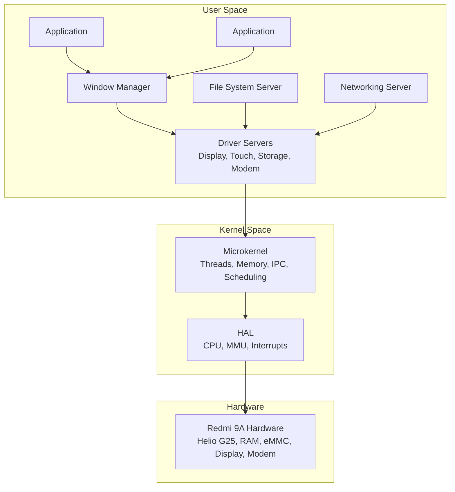
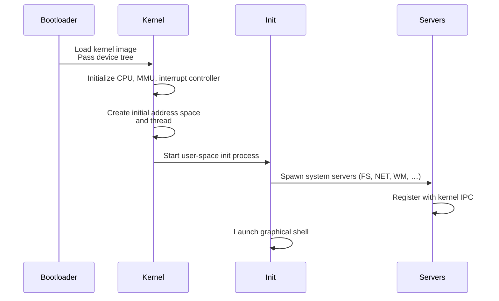
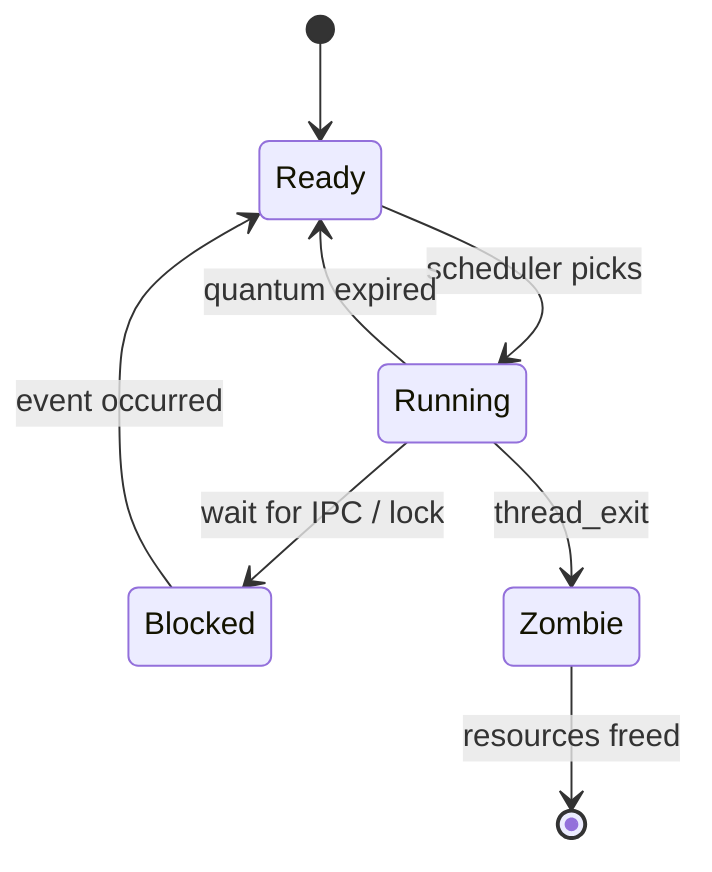

# Software Design Document (SDD)
## Redme-9A OS – Microkernel Operating System for Redmi 9A Smartphone

**Version:** 1.0  
**Date:** 2026-03-10  
**Authors:** Redme-9A OS Development Team  
**Status:** Draft  

---

## Table of Contents

1. [Introduction](#1-introduction)
2. [System Architecture](#2-system-architecture)
3. [Component Design](#3-component-design)
4. [Data Design](#4-data-design)
5. [Interface Design](#5-interface-design)
6. [Runtime Design](#6-runtime-design)
7. [Deployment Design](#7-deployment-design)
8. [Testing Strategy](#8-testing-strategy)
9. [Appendices](#9-appendices)

---

## 1 Introduction

### 1.1 Purpose
This document provides a detailed design specification for the Redme‑9A OS, a custom microkernel operating system written in Rust targeting the Redmi 9A smartphone hardware. It translates the requirements defined in the Software Requirements Specification (SRS) into concrete architectural decisions, component interactions, and implementation guidelines. The intended audience includes kernel developers, driver authors, system integrators, and testers.

### 1.2 Scope
The design covers the microkernel core, user‑space servers, device drivers, system services, and application framework. It assumes a `no_std` Rust environment, ARMv8‑A architecture, and the specific hardware components of the Redmi 9A (MediaTek Helio G25). Out‑of‑scope items (camera, GPS, Bluetooth) are noted as future extensions.

### 1.3 Definitions, Acronyms, and Abbreviations
- **OS:** Operating System
- **SDD:** Software Design Document
- **SRS:** Software Requirements Specification
- **IPC:** Inter‑Process Communication
- **MMU:** Memory Management Unit
- **HAL:** Hardware Abstraction Layer
- **RPC:** Remote Procedure Call
- **DMA:** Direct Memory Access
- **ELF:** Executable and Linkable Format
- **API:** Application Programming Interface
- **ABI:** Application Binary Interface
- **PMIC:** Power Management Integrated Circuit

### 1.4 References
- [Software Requirements Specification](SRS.md) (docs/SRS.md)
- Redmi 9A Hardware Specifications (MediaTek Helio G25 Datasheet)
- Rust Programming Language (Edition 2021)
- IEEE Std 1016‑2009 – Recommended Practice for Software Design Descriptions
- Liedtke, J. “On µ‑Kernel Construction” (1995)
- Embedded Rust `no_std` Guidelines

### 1.5 Document Overview
The SDD is organized into eight major sections: System Architecture, Component Design, Data Design, Interface Design, Runtime Design, Deployment Design, Testing Strategy, and Appendices. Each section elaborates on design decisions that satisfy the functional and non‑functional requirements listed in the SRS.

### 1.6 Requirements Traceability
The following table maps the key requirements from the SRS to the design sections that address them.

| Requirement ID | Requirement Category | Design Section |
|----------------|----------------------|----------------|
| FR‑001 – FR‑005 | Kernel Initialization & Core Services | [2. System Architecture](#2-system-architecture), [3.1 Kernel Core](#31-kernel-core) |
| FR‑006 – FR‑008 | Memory Management | [3.1.2 Memory Management](#312-memory-management) |
| FR‑009 – FR‑014 | Device Drivers | [3.2 Device Drivers](#32-device-drivers) |
| FR‑015 – FR‑018 | System Services | [3.3 System Services](#33-system-services) |
| FR‑019 – FR‑021 | User Interface | [3.3.3 Window‑Manager Server](#333-window-manager-server), [5.1 User Interfaces](#51-user-interfaces) |
| FR‑022 – FR‑024 | Application Support | [3.5 Application Framework](#35-application-framework), [5.3.3 Application ABI](#533-application-abi) |
| NFR‑001 – NFR‑004 | Performance | [6.3 Concurrency](#63-concurrency), [8.4 Performance Tests](#84-performance-tests) |
| NFR‑005 – NFR‑007 | Reliability | [3.4 Security Subsystem](#34-security-subsystem), [6.2 State Transitions](#62-state-transitions) |
| NFR‑008 – NFR‑011 | Security | [3.4 Security Subsystem](#34-security-subsystem), [5.3.1 System‑Call API](#531-system-call-api) |
| NFR‑012 – NFR‑013 | Portability | [2.1 High‑Level Overview](#21-high-level-overview), [3.1 Kernel Core](#31-kernel-core) |
| NFR‑014 – NFR‑016 | Maintainability | [9.2 Rust `no_std` Configuration](#92-rust-no_std-configuration), [9.3 Build System](#93-build-system) |
| EI‑001 – EI‑007 | Hardware Interfaces | [5.2 Hardware Interfaces](#52-hardware-interfaces), [9.1 Hardware Mapping](#91-hardware-mapping) |
| PR‑001 – PR‑005 | Performance Requirements | [6.1.1 Boot Sequence](#611-boot-sequence), [8.4 Performance Tests](#84-performance-tests) |
| SSR‑001 – SSR‑005 | Safety & Security | [3.4 Security Subsystem](#34-security-subsystem), [5.3.1 System‑Call API](#531-system-call-api) |

---


## 2 System Architecture

### 2.1 High‑Level Overview
Redme‑9A OS follows a pure microkernel architecture where the kernel provides only the most fundamental abstractions: threads, address spaces, IPC, and interrupt handling. All other functionality (device drivers, file systems, networking, graphical UI) runs as isolated user‑space servers. This design maximizes modularity, fault isolation, and security.

The system is structured in three layers:

1. **Hardware Abstraction Layer (HAL)** – Platform‑specific code that wraps CPU, memory, and peripheral registers.
2. **Microkernel** – Core kernel implementing threads, memory management, IPC, and scheduling.
3. **User‑Space Servers** – Protected processes that provide system services via IPC.

### 2.2 Architectural Diagram



### 2.3 Microkernel Decomposition
The microkernel is decomposed into the following subsystems:

- **Thread Management:** Creation, scheduling, synchronization, and termination of threads.
- **Memory Management:** Physical frame allocation, virtual address‑space creation, page‑table management, and memory‑mapped I/O.
- **IPC:** Synchronous message‑passing with capability‑based security.
- **Interrupt Handling:** Low‑level interrupt routing and delegation to user‑space drivers.
- **Synchronization:** Mutexes, semaphores, and condition variables built on top of atomic operations.

### 2.4 Key Design Principles
- **Minimality:** The kernel implements only what cannot be done in user space.
- **Safety:** Rust’s ownership and borrowing model is used to eliminate data races and memory errors at compile time.
- **Security:** Capability‑based access control for all inter‑process communication.
- **Performance:** Optimized IPC and context‑switch paths, lock‑free data structures where possible.
- **Portability:** Hardware‑specific code isolated in a HAL; the bulk of the kernel is platform‑agnostic.

---

## 3 Component Design

### 3.1 Kernel Core

#### 3.1.1 Thread Management
- **Data Structures:** `ThreadControlBlock` (TCB) containing stack pointer, register set, priority, state (Running, Ready, Blocked, Zombie).
- **Scheduler:** Priority‑based preemptive round‑robin with 64 priority levels. The scheduler runs on a timer tick (10 ms quantum) and on blocking system calls.
- **Synchronization:** `Mutex<T>` and `Semaphore` implemented as kernel objects; waiting threads are moved to a blocked queue.

#### 3.1.2 Memory Management
- **Physical Allocator:** Buddy allocator for 4 KiB frames, with a bitmap tracking free/used frames.
- **Virtual Memory:** Per‑process page tables (ARMv8‑A 4‑level translation). The kernel maps its own code/data into the higher‑half address space.
- **Memory‑Mapped I/O:** Device registers are mapped into kernel‑space; user‑space drivers receive capability‑guarded mappings.

#### 3.1.3 Inter‑Process Communication (IPC)
- **Mechanism:** Synchronous message‑passing via shared memory buffers and notification registers.
- **Capabilities:** Each IPC endpoint is associated with a capability token; messages can transfer capabilities.
- **RPC Support:** A lightweight RPC layer atop IPC allows servers to export call‑based interfaces.

#### 3.1.4 Interrupt Handling
- **Interrupt Descriptor Table (IDT)** maps hardware IRQs to handler routines.
- **Delegation:** The kernel demultiplexes interrupts and sends notifications to the appropriate user‑space driver via IPC.

### 3.2 Device Drivers

Drivers run as user‑space servers that communicate with hardware via kernel‑granted MMIO capabilities. Each driver implements a standard trait (`BlockDevice`, `Display`, `Input`, `Network`).

#### 3.2.1 Framebuffer Driver
- **Hardware:** MediaTek DISP (Display Controller) and DSI interface.
- **Design:** Maps the display’s framebuffer memory into the driver’s address space; provides a double‑buffered interface to the window manager.
- **Rust Interface:** `trait Display { fn set_resolution(&mut self, width: u32, height: u32) -> Result<(), DisplayError>; ... }`

#### 3.2.2 Touchscreen Driver
- **Hardware:** I²C‑based capacitive touch controller.
- **Design:** Polls or interrupts on touch events, translates raw coordinates to screen coordinates, sends `InputEvent` messages to the window manager.

#### 3.2.3 Storage Driver
- **Hardware:** eMMC 5.1 controller (MMC host).
- **Design:** Block‑oriented reads/writes using DMA; implements `BlockDevice` trait with `async` read/write methods.

#### 3.2.4 Cellular Modem Driver
- **Hardware:** MediaTek integrated 4G LTE modem (AT‑command interface over UART or shared memory).
- **Design:** Exposes a PPP‑like network interface; forwards IP packets to the networking stack.

#### 3.2.5 Power‑Management Driver
- **Hardware:** PMIC, battery gauge, and clock‑control registers.
- **Design:** Monitors battery level, charging status, and controls CPU sleep states (WFI/WFE).

### 3.3 System Services

#### 3.3.1 File‑System Server
- **Design:** FAT32‑compatible file system built on top of the block‑device driver. Implements a request‑response protocol over IPC.
- **Caching:** LRU page cache for frequently accessed blocks.

#### 3.3.2 Networking Stack
- **Design:** User‑space TCP/IP implementation (smoltcp or custom) that receives raw packets from the modem driver and provides socket API to applications.

#### 3.3.3 Window‑Manager Server
- **Design:** Compositing window manager that receives drawing commands from applications and blends them into the framebuffer. Handles input events from the touch driver.

#### 3.3.4 Audio Server
- **Design:** PCM mixer that merges streams from multiple applications and writes to the I2S audio controller.

### 3.4 Security Subsystem
- **Capability Model:** Each process holds a set of capabilities (e.g., `Capability::Mmio(phys_addr, size)`, `Capability::Ipc(endpoint)`). The kernel validates every operation against the calling process’s capability set.
- **Sandboxing:** Applications run with a restricted capability set; they cannot access hardware or other processes without explicit delegation.

### 3.5 Application Framework
- **`libredme`:** A Rust library that provides a safe wrapper around system calls and IPC stubs for accessing system services.
- **Application ABI:** ELF‑64 binaries with a defined entry point (`_start`). The dynamic linker loads dependencies and sets up capability environment.

---

## 4 Data Design

### 4.1 Kernel Data Structures

| Structure | Purpose | Fields (simplified) |
|-----------|---------|---------------------|
| `ThreadControlBlock` | Per‑thread metadata | `id: Tid`, `state: ThreadState`, `priority: u8`, `stack_ptr: usize`, `regs: [usize; 31]` |
| `AddressSpace` | Per‑process page tables | `root: PhysAddr`, `brk: VirtAddr`, `mmap_regions: Vec<MmapRegion>` |
| `IpcEndpoint` | IPC communication channel | `id: EndpointId`, `buffer: *mut u8`, `capabilities: Vec<Capability>` |
| `Capability` | Access‑control token | `type: CapType`, `object: CapObject`, `rights: Rights` |

### 4.2 Global Data
- **`cpu_local!`** macro for per‑CPU data (current thread, run‑queue, interrupt nesting level).
- **`PHYS_ALLOCATOR`:** Global instance of the buddy allocator (protected by a spinlock).
- **`IPC_REGISTRY`:** Kernel‑wide mapping from endpoint IDs to endpoint objects.

### 4.3 Database Design
Not applicable – the OS does not include a relational database. File‑system metadata is stored in on‑disk structures (FAT32 directory entries, inodes, etc.).

---

## 5 Interface Design

### 5.1 User Interfaces
- **Graphical Shell:** A home‑screen application that launches other apps. Renders icons and responds to touch gestures.
- **Virtual Keyboard:** A soft keyboard that appears when a text‑input field is focused.
- **System Settings:** A configuration app for Wi‑Fi, display brightness, volume, etc. (future).

### 5.2 Hardware Interfaces
- **CPU:** ARM Cortex‑A53 (ARMv8‑A 64‑bit). The kernel uses `MSR`/`MRS` instructions to control system registers.
- **Memory:** 2 GB LPDDR4x mapped at physical address `0x8000_0000`.
- **Peripherals:** Memory‑mapped registers as described in the Helio G25 datasheet (UART, I2C, SPI, MMC, DISP, etc.).

### 5.3 Software Interfaces

#### 5.3.1 System‑Call API
System calls are invoked via the `svc` instruction. The kernel provides the following categories of calls:

- **Thread:** `thread_create`, `thread_exit`, `thread_yield`, `mutex_lock`, `mutex_unlock`.
- **Memory:** `mmap`, `munmap`, `brk`.
- **IPC:** `ipc_send`, `ipc_receive`, `ipc_call`.
- **Capabilities:** `cap_grant`, `cap_revoke`, `cap_transfer`.

The full API is defined in the crate `redme‑syscalls` (to be generated via `bindgen`).

#### 5.3.2 Driver Traits
```rust
// Example trait for block devices
pub trait BlockDevice {
    async fn read(&self, block: u64, buf: &mut [u8]) -> Result<(), BlockError>;
    async fn write(&self, block: u64, buf: &[u8]) -> Result<(), BlockError>;
    fn block_size(&self) -> usize;
}
```

#### 5.3.3 Application ABI
Applications are linked against `libredme` and call functions such as `redme::window::create_window(...)`. The library translates these into IPC messages to the appropriate server.

---

## 6 Runtime Design

### 6.1 Dynamic Behavior

#### 6.1.1 Boot Sequence


#### 6.1.2 Thread Lifecycle
1. **Creation:** `thread_create` allocates a TCB and stack, adds thread to ready queue.
2. **Scheduling:** Scheduler picks the highest‑priority ready thread; performs context switch.
3. **Blocking:** Thread calls `mutex_lock` on a held lock → moved to blocked queue.
4. **Termination:** Thread calls `thread_exit` → resources reclaimed, parent notified.

#### 6.1.3 IPC Flow
1. Client calls `ipc_send(endpoint, message)`.
2. Kernel copies message into endpoint buffer, marks client as blocked.
3. Server calls `ipc_receive(endpoint)` → receives message, client unblocked.
4. Server processes request, optionally sends reply via `ipc_send`.

### 6.2 State Transitions



### 6.3 Concurrency
- **Kernel Preemption:** The kernel is fully preemptible except for short critical sections guarded by interrupt disabling.
- **Locking:** Spinlocks used for kernel data structures accessed from interrupt context; mutexes for user‑visible synchronization.
- **Async Drivers:** Device drivers use Rust’s `async`/`await` to handle multiple pending I/O operations without blocking threads.

---

## 7 Deployment Design

### 7.1 Boot Process
1. **Bootloader:** U‑Boot or custom bootloader loads the kernel image and device‑tree blob from eMMC into RAM at a predefined address.
2. **Kernel Entry:** Bootloader jumps to `_start` with MMU disabled, CPU in EL2 (Hypervisor) or EL1 (Kernel) mode.
3. **Early Initialization:** Kernel sets up minimal page tables, enables MMU, relocates itself to high virtual address.
4. **Runtime Setup:** Initialize physical allocator, create kernel threads, start interrupt handling.
5. **User‑Space:** Load the init process (ELF) from the file‑system image, create its address space, and transfer control.

### 7.2 Installation
- **Flashing:** The OS is distributed as a single binary image (`redme‑9a‑os.img`) that can be flashed to the device’s eMMC via `fastboot` or MediaTek’s SP Flash Tool.
- **Partition Layout:**  
  - `boot`: kernel image + device tree  
  - `system`: read‑only system servers and libraries  
  - `data`: writable user data and applications

### 7.3 Configuration
- **Kernel Command Line:** Passed by bootloader to set debug flags, memory limits, etc.
- **System Configuration:** Stored in `/etc/redme.conf` (key‑value pairs) parsed by the init process.

---

## 8 Testing Strategy

### 8.1 Unit Tests
- **Kernel Modules:** Each kernel subsystem (scheduler, allocator, IPC) is compiled as a library and tested on the host using `cargo test` with a mock HAL.
- **Drivers:** Driver traits are tested with a virtual hardware simulator (QEMU).

### 8.2 Integration Tests
- **IPC Tests:** Verify message‑passing between user‑space servers in a simulated environment.
- **Service Integration:** Bring up the file‑system server with a RAM‑disk block device and run POSIX‑like file operations.

### 8.3 System Tests
- **Hardware Emulation:** Run the full OS in QEMU with a virtual Redmi 9A machine model (extended with MediaTek peripheral emulation).
- **Real Hardware:** Flash the image onto a Redmi 9A device and execute test suites over UART console.

### 8.4 Performance Tests
- **Micro‑benchmarks:** Measure context‑switch latency, IPC round‑trip time, memory allocation throughput.
- **Macro‑benchmarks:** Boot time, application launch time, UI rendering frames per second.

### 8.5 Security Tests
- **Capability Leakage:** Attempt to access resources without proper capabilities; verify denial.
- **Fuzz Testing:** Apply random IPC messages to servers to uncover crashes or violations.

---

## 9 Appendices

### 9.1 Redmi 9A Hardware Mapping

| Peripheral | Base Address (Physical) | Driver Server |
|------------|------------------------|---------------|
| UART0      | 0x1100_2000            | Debug Console |
| I2C0       | 0x1100_8000            | Touchscreen   |
| MMC        | 0x1123_0000            | Storage       |
| DISP       | 0x1400_0000            | Framebuffer   |
| Modem      | 0x2000_0000 (shared)   | Cellular      |

### 9.2 Rust `no_std` Configuration
The kernel and all core services are compiled with `#![no_std]`. The following crates are used:

- `core`, `alloc` – provided by `rustc` for the `aarch64‑unknown‑none` target.
- `spin` – for spinlocks and lazy statics.
- `bit_field` – for bit‑manipulation of hardware registers.
- `volatile` – safe access to MMIO.

### 9.3 Build System
- **Cargo Workspace:** Separate crates for `kernel`, `hal`, `drivers`, `servers`, `libredme`.
- **Cross‑Compilation:** `cargo build --target aarch64‑unknown‑none --release`
- **Image Creation:** `objcopy` to produce a raw binary; combined with a bootloader stub via `ld`.

### 9.4 Revision History

| Version | Date       | Author               | Changes                     |
|---------|------------|----------------------|-----------------------------|
| 1.0     | 2026‑03‑10 | Development Team     | Initial SDD draft           |

---

*This document is maintained in the project repository at `docs/SDD.md`.*