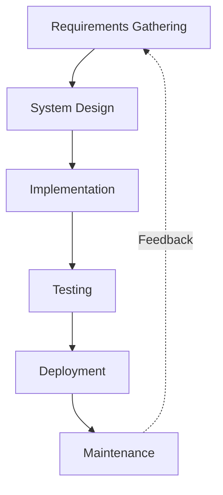
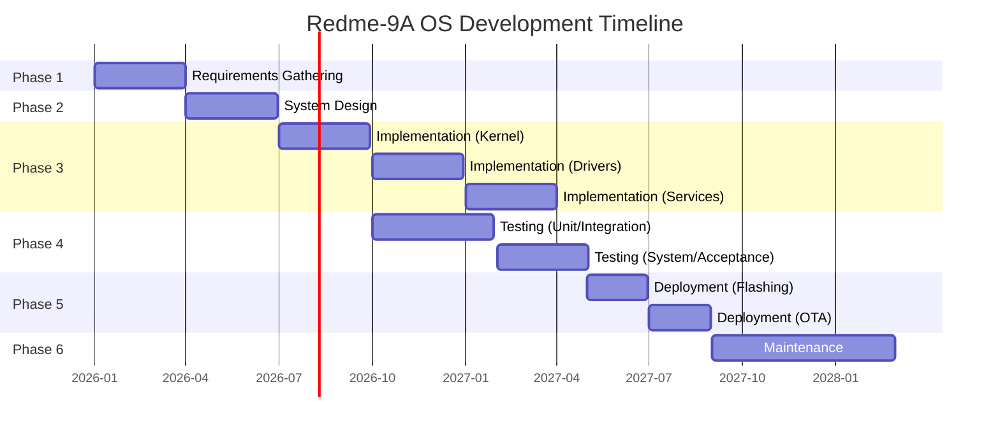

# Software Development Life Cycle (SDLC) – Redme‑9A OS

**Version:** 1.0  
**Date:** 2026‑03‑10  
**Authors:** Redme‑9A OS Development Team  
**Status:** Draft  

---

## Table of Contents

1. [Introduction](#1-introduction)
2. [SDLC Model Selection](#2-sdlc-model-selection)
3. [Phase 1: Requirements Gathering](#3-phase-1-requirements-gathering)
4. [Phase 2: System Design](#4-phase-2-system-design)
5. [Phase 3: Implementation](#5-phase-3-implementation)
6. [Phase 4: Testing](#6-phase-4-testing)
7. [Phase 5: Deployment](#7-phase-5-deployment)
8. [Phase 6: Maintenance](#8-phase-6-maintenance)
9. [Roles and Responsibilities](#9-roles-and-responsibilities)
10. [Tools and Technologies](#10-tools-and-technologies)
11. [Risk Management](#11-risk-management)
12. [Timeline and Milestones](#12-timeline-and-milestones)
13. [Appendices](#13-appendices)

---

## 1 Introduction

### 1.1 Purpose
This document defines the Software Development Life Cycle (SDLC) for the Redme‑9A OS project – a custom microkernel operating system written in Rust, targeting the Redmi 9A smartphone hardware. The SDLC describes the process, phases, roles, tools, and milestones that guide development from conception to deployment and maintenance. It ensures a structured, repeatable, and quality‑focused approach to building a safe, reliable embedded OS.

### 1.2 Scope
The SDLC covers the entire lifecycle of Redme‑9A OS:
- **Requirements elicitation** – capturing functional, non‑functional, and hardware‑specific needs.
- **System design** – architectural decisions, component decomposition, and interface specifications.
- **Implementation** – coding, version control, continuous integration, and code review practices.
- **Testing** – unit, integration, system, and acceptance testing, both in emulation and on real hardware.
- **Deployment** – creating bootable images, flashing to devices, and enabling over‑the‑air (OTA) updates.
- **Maintenance** – post‑release bug fixes, performance improvements, and feature extensions.

The lifecycle is tailored to a **microkernel OS** written in **Rust**, emphasizing memory safety, modularity, and real‑time performance on embedded smartphone hardware.

### 1.3 Relationship to Other Documents
- **[Software Requirements Specification (SRS)](SRS.md)** – defines *what* the system must do; the SDLC describes *how* those requirements are captured, validated, and traced through development.
- **[Software Design Document (SDD)](SDD.md)** – details the architectural and component design; the SDLC outlines the design phase activities and deliverables.
- **[README.md](../README.md)** – provides a high‑level project overview and build instructions; the SDLC complements it with process‑oriented guidance.

---

## 2 SDLC Model Selection

### 2.1 Chosen Model: **Iterative‑Incremental with Agile Practices**
Redme‑9A OS follows an **iterative‑incremental** lifecycle, blended with **Agile** practices (short sprints, continuous feedback, adaptive planning). This hybrid approach is justified by:

- **Complexity & novelty** – Building a microkernel OS for a specific smartphone involves many unknowns; iterative cycles allow learning and course correction.
- **Risk mitigation** – Early prototyping of critical subsystems (bootloader, memory manager) reduces technical risk before committing to a full implementation.
- **Embedded constraints** – Hardware dependencies (MediaTek Helio G25) require frequent on‑device testing; each iteration can validate a subset of functionality on real hardware.
- **Safety‑critical nature** – Rust’s memory‑safety guarantees are essential; iterative development allows incremental verification of safe‑code practices.

### 2.2 Lifecycle Phases Overview
The SDLC is organized into six sequential **phases**, each consisting of multiple **iterations** (typically 2‑4 weeks). Each iteration delivers a working, testable increment of the system.

### 2.3 Justification Against Alternatives
- **Waterfall** – Too rigid for an OS with evolving hardware understanding; not suitable.
- **Pure Agile (Scrum/Kanban)** – Lack of upfront architectural planning could lead to inconsistent design; however, Agile practices are incorporated within each phase.
- **V‑Model** – Strong on verification/validation but assumes requirements are frozen early; we adopt its testing parallelism (each development stage has a corresponding test stage) within iterations.
- **Spiral** – Risk‑driven but overly heavyweight; we borrow its risk‑assessment steps in each iteration.

The chosen model balances **predictability** (phases) with **adaptability** (iterations), aligning with the project’s dual goals of safety and innovation.

---

## 3 Phase 1: Requirements Gathering

### 3.1 Objectives
- Capture and prioritize functional, non‑functional, and hardware‑interface requirements.
- Establish measurable acceptance criteria for each requirement.
- Create a traceability matrix linking requirements to design, implementation, and test artifacts.

### 3.2 Activities
1. **Stakeholder Workshops** – Engage kernel developers, embedded engineers, and potential end‑users to identify needs.
2. **Hardware Analysis** – Review MediaTek Helio G25 datasheets, Redmi 9A schematics, and peripheral documentation.
3. **Requirement Elicitation** – Use cases, user stories, and technical constraints are documented.
4. **Requirement Specification** – Formalize requirements in the [SRS](SRS.md) using a structured template (IEEE‑830).
5. **Prioritization** – MoSCoW (Must‑have, Should‑have, Could‑have, Won’t‑have) applied to manage scope.
6. **Validation** – Review sessions with stakeholders to confirm correctness and feasibility.

### 3.3 Deliverables
- **[Software Requirements Specification (SRS)](SRS.md)** – The authoritative requirements document.
- **Requirements Traceability Matrix (RTM)** – Spreadsheet or tool‑based mapping of requirements to design elements and tests.
- **Risk Register (initial)** – Identified risks related to hardware availability, Rust ecosystem gaps, etc.

### 3.4 Tools
- **Documentation:** Markdown, Pandoc, Git‑hosted wikis.
- **Tracking:** GitHub Issues, Projects, or JIRA for requirement items.
- **Modeling:** PlantUML for use‑case diagrams, Mermaid for flowcharts.

---

## 4 Phase 2: System Design

### 4.1 Objectives
- Transform requirements into a concrete, implementable architecture.
- Define microkernel components, user‑space servers, and their interfaces.
- Ensure design satisfies safety, performance, and portability constraints.

### 4.2 Activities
1. **Architectural Design** – Select microkernel pattern, decompose system into kernel‑space and user‑space layers.
2. **Component Design** – Specify each major subsystem (thread manager, memory manager, IPC, drivers, services).
3. **Interface Design** – Define system‑call API, driver traits, IPC protocols, and hardware‑abstraction layer (HAL) contracts.
4. **Data Design** – Design key data structures (ThreadControlBlock, PageTable, Capability) with Rust ownership in mind.
5. **Security Design** – Capability‑based access‑control model, secure boot, and memory‑isolation mechanisms.
6. **Design Review** – Conduct formal inspections using the [Software Design Document (SDD)](SDD.md) as the primary artifact.

### 4.3 Deliverables
- **[Software Design Document (SDD)](SDD.md)** – Comprehensive design specification.
- **Architectural Diagrams** – Mermaid block diagrams, component‑interaction charts.
- **Interface Contracts** – Rust trait definitions, protocol buffers (if applicable), ABI specifications.
- **Hardware‑Mapping Table** – Register maps, interrupt lines, DMA channels for Helio G25.

### 4.4 Tools
- **Diagrams:** Mermaid (embedded in Markdown), draw.io.
- **Design Documentation:** Markdown, LaTeX (if needed).
- **Prototyping:** QEMU for early architectural validation.

---

## 5 Phase 3: Implementation

### 5.1 Objectives
- Produce high‑quality, memory‑safe Rust code that realizes the design.
- Maintain a consistent codebase with comprehensive documentation and tests.
- Integrate components incrementally, ensuring each iteration is buildable and testable.

### 5.2 Activities
1. **Setup Development Environment** – Install Rust nightly, cross‑compilation toolchains, QEMU, and debugging tools.
2. **Coding Standards** – Adopt Rustfmt, Clippy, and mandatory `// SAFETY:` comments for `unsafe` blocks.
3. **Version Control** – Use Git with [Conventional Commits](https://www.conventionalcommits.org/); branch‑per‑feature, pull‑request workflow.
4. **Continuous Integration** – GitHub Actions runs `cargo check`, `cargo test`, `cargo clippy`, and `cargo fmt` on every push.
5. **Code Reviews** – All changes require at least one reviewer; focus on safety, correctness, and adherence to design.
6. **Incremental Integration** – Merge feature branches after passing CI and review; maintain a always‑green `main` branch.

### 5.3 Deliverables
- **Source Code** – The complete Rust codebase under `src/`.
- **Build System** – `Cargo.toml`, `.cargo/config.toml`, and any necessary `build.rs` scripts.
- **API Documentation** – Generated via `cargo doc` and hosted on GitHub Pages.
- **CI/CD Configuration** – `.github/workflows/` YAML files.

### 5.4 Tools
- **Language:** Rust (nightly) with `no_std`, `cortex‑a`, `bare‑metal` crates.
- **Build & Package:** Cargo, cargo‑make, cargo‑build‑dependencies.
- **CI/CD:** GitHub Actions, Docker for reproducible builds.
- **Code Quality:** Rustfmt, Clippy, tarpaulin (coverage), cargo‑audit (security).

---

## 6 Phase 4: Testing

### 6.1 Objectives
- Validate that the implemented system meets all requirements.
- Ensure reliability, performance, and security under expected and edge‑case conditions.
- Provide evidence for release readiness.

### 6.2 Testing Levels
1. **Unit Testing** – Per‑function/module tests using Rust’s built‑in `#[test]` framework. Run on host (std) and target (QEMU) where possible.
2. **Integration Testing** – Test interactions between kernel components and user‑space servers via IPC.
3. **System Testing** – Full‑stack testing on QEMU emulator, verifying boot, memory management, driver loading, and basic UI.
4. **Acceptance Testing** – Execute predefined acceptance criteria (from SRS) on real Redmi 9A hardware.
5. **Performance Testing** – Measure interrupt latency, context‑switch time, IPC round‑trip, and boot duration against NFRs.
6. **Security Testing** – Fuzz IPC endpoints, audit capability leaks, validate memory isolation.

### 6.3 Activities
- **Test‑First Development** – Write unit tests before implementing features (where practical).
- **Automated Test Suites** – Integrate with CI; run on every commit.
- **Hardware‑in‑the‑Loop (HIL)** – Automated scripts flash device, run tests, and collect logs.
- **Regression Testing** – Maintain a growing suite of regression tests to catch reintroduced bugs.

### 6.4 Deliverables
- **Test Plans** – Documents describing test scope, approach, and resources.
- **Test Cases/Scripts** – Concrete tests (Rust test functions, Python scripts for HIL).
- **Test Reports** – Pass/fail results, performance metrics, coverage reports.
- **Bug Reports** – Issues filed in GitHub with steps to reproduce.

### 6.5 Tools
- **Rust Testing:** `cargo test`, `cargo tarpaulin`, `proptest` (property‑based).
- **Emulation:** QEMU with GDB stub for debugging.
- **Hardware Testing:** `adb`, `fastboot`, custom test harnesses.
- **Fuzzing:** `cargo fuzz`, `AFL`.

---

## 7 Phase 5: Deployment

### 7.1 Objectives
- Package the OS into a bootable image suitable for the Redmi 9A.
- Establish a reliable flashing procedure for developers and early adopters.
- Enable over‑the‑air (OTA) updates for future releases.

### 7.2 Activities
1. **Image Creation** – Combine kernel, initramfs (if any), device‑tree blob, and bootloader into a single `boot.img`.
2. **Flashing Procedure** – Document steps for unlocking bootloader, entering fastboot, and flashing partitions.
3. **OTA Infrastructure** – Design a secure update server and client that downloads, verifies, and applies delta updates.
4. **Release Packaging** – Generate signed release artifacts (images, checksums, changelog) for each version.
5. **Deployment Verification** – Smoke‑test flashed devices to ensure basic functionality.

### 7.3 Deliverables
- **Bootable Images** – `boot.img`, `system.img` (if needed) in `target/` directory.
- **Flashing Guide** – Step‑by‑step instructions in `README.md` or a dedicated `FLASHING.md`.
- **OTA Update Client** – User‑space daemon that communicates with the update server.
- **Release Notes** – Markdown file describing changes, known issues, and upgrade instructions.

### 7.4 Tools
- **Image Tools:** `mkbootimg`, `dtc` (device‑tree compiler), `abootimg`.
- **Flashing:** `fastboot`, `adb`.
- **Signing:** `openssl`, `sbsign` (UEFI‑style), or custom signing scripts.
- **OTA:** Simple HTTP server with manifest files, Rust client using `reqwest`.

---

## 8 Phase 6: Maintenance

### 8.1 Objectives
- Provide timely bug fixes and security patches.
- Evolve the OS with new features and hardware support.
- Monitor system performance and stability in the field.

### 8.2 Activities
1. **Issue Triage** – Classify incoming bug reports (critical, high, medium, low) and assign to appropriate developers.
2. **Patch Development** – Follow the same SDLC phases (requirements, design, implementation, testing) for each patch.
3. **Release Management** – Schedule regular maintenance releases (e.g., monthly) and urgent security releases as needed.
4. **Performance Monitoring** – Collect anonymized metrics (with user consent) to identify bottlenecks.
5. **Documentation Updates** – Keep SRS, SDD, SDLC, and user guides up‑to‑date with changes.

### 8.3 Deliverables
- **Patched Releases** – Versioned updates (e.g., v1.0.1, v1.1.0).
- **Changelog** – `CHANGELOG.md` recording all changes.
- **Knowledge Base** – FAQ, troubleshooting guides, community‑contributed tips.

### 8.4 Tools
- **Issue Tracking:** GitHub Issues with labels, milestones.
- **Communication:** Discord/Slack for community support, GitHub Discussions.
- **Monitoring:** Optional telemetry module (opt‑in) that reports crashes/perf data.

---

## 9 Roles and Responsibilities

| Role | Responsibilities | Key Activities |
|------|------------------|----------------|
| **Project Manager** | Overall planning, resource allocation, risk management, stakeholder communication. | Define milestones, track progress, facilitate meetings, manage budget (if any). |
| **Lead Architect** | Technical vision, architectural decisions, design reviews, ensuring consistency with microkernel principles. | Write SDD, evaluate design alternatives, mentor developers. |
| **Kernel Developer** | Implement core microkernel components (scheduler, memory manager, IPC). | Write Rust code, conduct unit tests, review peers’ code, debug low‑level issues. |
| **Driver Developer** | Develop user‑space drivers for display, touch, storage, modem, sensors. | Interface with hardware datasheets, write safe `unsafe` code, integrate with HAL. |
| **System‑Service Developer** | Build user‑space servers (file system, networking, window manager). | Implement IPC protocols, design service APIs, ensure fault isolation. |
| **Test Engineer** | Design and execute test plans, automate test suites, report bugs. | Write integration/system tests, perform hardware‑in‑the‑loop testing, measure performance. |
| **Release Engineer** | Create deployable images, manage CI/CD pipeline, oversee OTA updates. | Maintain build scripts, sign releases, coordinate deployment with testers. |
| **Documentation Writer** | Produce and maintain project documentation (SRS, SDD, SDLC, user guides). | Edit Markdown files, ensure clarity and completeness, update diagrams. |

---

## 10 Tools and Technologies

### 10.1 Programming & Build
- **Language:** Rust (nightly, edition 2021) with `no_std` for kernel, `std` for user‑space.
- **Build System:** Cargo, cargo‑make.
- **Cross‑Compilation:** `aarch64‑unknown‑none‑softfloat`, `arm‑none‑eabi‑gcc`.
- **Code Formatting:** `rustfmt` (nightly).
- **Linting:** `clippy` (with `-D warnings`).
- **Dependency Management:** Cargo.toml, cargo‑vendor.

### 10.2 Version Control & Collaboration
- **Version Control:** Git, hosted on GitHub.
- **Branch Strategy:** Feature branches, pull requests, squash‑merge.
- **Code Review:** GitHub Pull Request reviews.
- **Issue Tracking:** GitHub Issues with labels, milestones, projects.
- **CI/CD:** GitHub Actions (build, test, coverage, release).

### 10.3 Emulation & Debugging
- **Emulator:** QEMU (system‑mode for ARM/AArch64).
- **Debugger:** GDB with Rust support, `cargo‑embed`, `probe‑rs`.
- **Logging:** `log` crate, semihosting, UART serial output.

### 10.4 Hardware & Deployment
- **Target Device:** Redmi 9A (MediaTek Helio G25).
- **Bootloader:** U‑Boot (ported) or custom second‑stage loader.
- **Flashing:** `fastboot`, `adb`.
- **OTA:** Custom Rust client, HTTP server.

### 10.5 Documentation
- **Format:** Markdown (`.md`).
- **Diagramming:** Mermaid (embedded in Markdown), draw.io.
- **Generation:** `cargo doc`, `mdBook` for user guides.

---

## 11 Risk Management

### 11.1 Identified Risks & Mitigations

| Risk | Probability | Impact | Mitigation Strategy |
|------|-------------|--------|---------------------|
| **Hardware documentation incomplete** | High | High | – Collaborate with MediaTek community; reverse‑engineer via existing Linux drivers. – Purchase official developer board (if available) for experimentation. |
| **Rust `no_std` ecosystem gaps** | Medium | Medium | – Contribute missing crates (e.g., ARMv8‑A HAL). – Fallback to small, well‑audited C libraries (with FFI) where absolutely necessary. |
| **Bootloader porting fails** | High | Critical | – Start with U‑Boot reference port; keep a minimal second‑stage loader as backup. – Use QEMU to verify boot logic before hardware. |
| **Memory‑safety bugs in `unsafe` blocks** | Medium | Critical | – Rigorous code review for every `unsafe` block; require `// SAFETY:` justification. – Use formal‑verification tools (e.g., `creusot`, `kani`) where possible. |
| **Performance does not meet NFRs** | Medium | High | – Profile early with QEMU and hardware performance counters. – Optimize hot paths (context‑switch, IPC) with assembly intrinsics. |
| **Device bricking during flashing** | Low | Critical | – Provide detailed recovery instructions, pre‑built recovery images. – Encourage use of QEMU for initial development. |
| **Community/contributor attrition** | Medium | Medium | – Maintain clear onboarding documentation, label `good‑first‑issue` tasks. – Regular virtual meetings, celebrate contributions. |

### 11.2 Risk Monitoring
- **Risk Register** maintained in a shared spreadsheet or GitHub Project.
- **Monthly risk‑review meetings** to assess changes in probability/impact.
- **Trigger‑based responses** – when a risk materializes, execute predefined contingency plans.

---

## 12 Timeline and Milestones

### 12.1 High‑Level Schedule
The project is planned over **18 months**, divided into six 3‑month macro‑iterations. Each macro‑iteration corresponds to one SDLC phase but includes mini‑iterations (sprints) within it.

### 12.2 Key Milestones
| Milestone | Date (Planned) | Deliverables |
|-----------|----------------|--------------|
| **M1 – Requirements Baseline** | 2026‑03‑31 | Approved SRS v1.0, initial RTM. |
| **M2 – Architectural Design Complete** | 2026‑06‑30 | Approved SDD v1.0, architectural diagrams. |
| **M3 – Kernel Core Operational** | 2026‑09‑30 | Microkernel boots on QEMU, supports threads, memory, IPC. |
| **M4 – Basic Drivers Working** | 2026‑12‑31 | Display, touch, storage drivers run in user‑space on QEMU. |
| **M5 – System Services Integrated** | 2027‑03‑31 | File system, networking, window‑manager servers communicate via IPC. |
| **M6 – Alpha Release (QEMU)** | 2027‑06‑30 | Full‑stack OS runs in emulation, passes system‑test suite. |
| **M7 – Beta Release (Hardware)** | 2027‑09‑30 | OS boots on Redmi 9A, basic UI functional, cellular data works. |
| **M8 – Stable Release 1.0** | 2027‑12‑31 | All SRS requirements satisfied, OTA updates ready, documentation complete. |

### 12.3 Iteration Planning
Each 3‑month macro‑iteration is broken into **six 2‑week sprints**. Sprint goals are tracked via GitHub Projects. The team holds:
- **Sprint Planning** – first day of sprint.
- **Daily Stand‑ups** – 15‑minute sync (virtual).
- **Sprint Review** – demo of completed work.
- **Sprint Retrospective** – process improvement.

---

## 13 Appendices

### 13.1 Glossary
- **Microkernel** – Kernel that provides only essential services (threads, memory, IPC); other functionality runs in user‑space.
- **HAL** – Hardware Abstraction Layer; platform‑specific code that isolates hardware details.
- **IPC** – Inter‑Process Communication; message‑passing between user‑space processes.
- **OTA** – Over‑The‑Air; wireless delivery of software updates.
- **RTM** – Requirements Traceability Matrix.
- **NFR** – Non‑Functional Requirement.

### 13.2 References
- [Software Requirements Specification (SRS)](SRS.md)
- [Software Design Document (SDD)](SDD.md)
- [README.md](../README.md)
- [Rust Language Reference](https://doc.rust-lang.org/reference/)
- [ARM Architecture Reference Manual (ARMv8‑A)](https://developer.arm.com/documentation/ddi0487/latest)
- [MediaTek Helio G25 Datasheet](https://www.mediatek.com/products/smartphones/mediatek-helio-g25)

### 13.3 Document History
| Version | Date | Changes | Author |
|---------|------|---------|--------|
| 1.0 | 2026‑03‑10 | Initial SDLC draft | Redme‑9A OS Development Team |

---

*This SDLC is a living document. It will be updated as the project evolves, reflecting lessons learned and process improvements.*